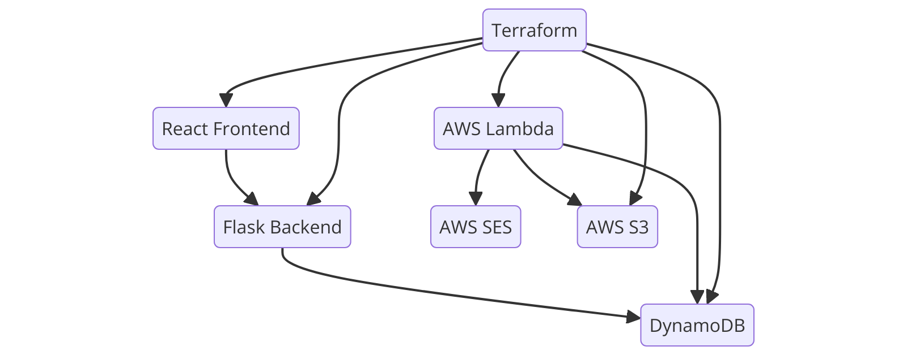

# AWS Email Application

## Overview

This project demonstrates an AWS-based email application that allows users to subscribe to a newsletter via a web form, store the subscription information in DynamoDB, generate a CSV file of subscribers, and send personalized emails using AWS Lambda, SES, and S3. The infrastructure is managed using Terraform.

## Features

- **React Frontend**: A clean, responsive web form for subscribing to the newsletter.
- **Flask Backend**: A REST API to handle subscription requests and store data in DynamoDB.
- **AWS Lambda**: Processes uploaded CSV files and sends personalized emails.
- **AWS SES**: Sends emails to subscribers.
- **AWS S3**: Stores generated subscriber CSV files.
- **DynamoDB**: Stores subscription information.
- **Terraform**: Manages all AWS infrastructure as code.

## Architecture



## Prerequisites

- Node.js (v16.x recommended for React compatibility)
- Python (v3.x)
- AWS CLI (configured with IAM user credentials)
- Terraform
- Git

---

## Setup Instructions

### 1. Clone the Repository

```sh
git clone https://github.com/your-username/aws-email-project.git
cd aws-email-project
```

---

### 2. Set up the Frontend

Navigate to the React app, install dependencies, and start the dev server:

```sh
cd email-collection
npm install
npm start
```

> 💡 If you're using Node v17+, you may need to run:
> `set NODE_OPTIONS=--openssl-legacy-provider` before `npm start`.

---

### 3. Set up the Backend

Navigate to the Flask API and install dependencies:

```sh
cd ../email-api
pip install Flask boto3 flask-cors
python app.py
```

---

### 4. Deploy the AWS Infrastructure with Terraform

From the project root:

```sh
cd ..
terraform init
terraform apply
```

When it completes, export the generated S3 bucket name for use in your script:

```sh
terraform output -raw bucket_name > bucket_name.txt
```

---

### 5. Generate and Upload Subscriber CSV

Run the Python script to pull subscribers from DynamoDB, generate a CSV, and upload it to S3:

```sh
python generate_and_upload_csv_dynamic.py
```

---

## Usage

1. **Subscribe to the Newsletter**  
   Open the app at `http://localhost:3000`, enter an email, and click **Subscribe**.  
   The form resets after submission and displays a temporary success message.

2. **Verify Subscription**  
   Go to the AWS Console → **DynamoDB → Emails table → Explore Table Items**  
   Confirm the email appears in the table.

3. **Generate & Upload CSV**  
   Run the script above to generate and upload the subscriber list to S3.

4. **Send Emails**  
   Once the CSV is uploaded, **Lambda is automatically triggered**, reads the CSV, and sends personalized emails to each subscriber using **AWS SES**.

---

## Cleaning Up

To avoid AWS charges, run:

```sh
terraform destroy
```

This will remove all AWS resources created for the project.
